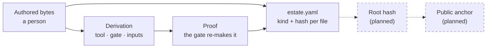

<p align="center">
  <a href="https://nika.sh">
    <picture>
      <source media="(prefers-color-scheme: dark)" srcset="https://nika.sh/brand/nika-logo-dark.svg">
      
    </picture>
  </a>
</p>

<h1 align="center">nika-estate</h1>

<p align="center">
  <strong>Know where every file in Nika comes from, and check it yourself.</strong><br>
  Each file is written by a person or produced by a recorded step you can re-run. One small tool says which, and a self-test proves it refuses what it should.
</p>

<p align="center">
  <a href="https://github.com/supernovae-st/nika-estate/actions/workflows/gate.yml"></a>
  <a href="scripts/estate.py"></a>
  <a href="SCHEMA.md"></a>
  <a href="LICENSE"></a>
</p>

<p align="center"><strong>Watch the check refuse one edited file, name the fix, then pass again.</strong></p>

<p align="center">
  <a href="media/the-bite.gif">
    
  </a>
</p>

<p align="center"><sub>A copy of a real repository (nika-registry) and the shared tool: in sync, one staged edit refused, undone, in sync again. Every verdict is the tool's own output, recorded with <a href="scripts/media/the-bite.tape">the-bite.tape</a>.</sub></p>

## What is Nika?

Nika turns repeatable AI work into a small file you keep: a readable `.nika`
workflow. Before anything runs, `nika check` shows what it will do, what it
may touch and what it can cost, without calling a model. You run it when you
decide, with the model you choose, local or cloud, and every run leaves a
tamper-evident record you can verify.

| 1 · Say it | 2 · Check it | 3 · Run it | 4 · Prove it |
|:---:|:---:|:---:|:---:|
| Describe the job; Nika writes a `.nika` file | `nika check` audits it before any model is called | `nika run` with the model you choose | `nika trace verify` checks the run's record |

> [!TIP]
> **nika-estate does for Nika's own repositories what a trace does for a
> run.** It records where every file of the project comes from, in a form
> anyone can re-check. It is a maintainer's tool: you do not need it to use
> Nika.

## Provenance in plain words

Every file in the Nika ecosystem is one of two things:

| Written by a person | Produced by a recorded step |
|---|---|
| A page, a piece of code, a version pin someone chose on purpose. | A generated file names the tool that made it, the check that re-makes it and the inputs it came from. A copied file names where it was copied from. |

Captured evidence, such as test fixtures and recorded traces, and pointers to
third-party sources are labelled as such too.

Each repository that uses this tool keeps a manifest, `estate.yaml`, listing
every tracked file with its kind and its hash. Nobody writes the manifest by
hand: anyone can regenerate it from the repository and compare the two byte
for byte. You need Python and git, not anyone's word.

The goal is for every manifest in the ecosystem to fold into **one hash**,
published where anyone can check it, so the whole ecosystem can be re-checked
from that single value without trusting any institution, including us.

> [!NOTE]
> **Where it stands today.** Four repositories of the family carry a
> manifest: nika, nika-spec, nika-docs and nika-registry. The others, this one
> included, do not yet. Each carrier fails its CI when its copy of the tool
> differs from the pinned version. The manifests observe rather
> than enforce: each repository decides which findings block a change. The
> fold into one hash and its public anchor are the next step and are **not
> built yet**; this repository's `closure` job is a placeholder until then.

## Try it in one minute

You need Python 3.9 or newer and git. There is nothing to install.

1. **Get the tool.**

   ```sh
   git clone https://github.com/supernovae-st/nika-estate && cd nika-estate
   ```

2. **Watch it refuse.** The self-test builds a throwaway repository, plants
   one known mistake at a time and checks each answer and exit code. It
   touches nothing outside a temporary folder.

   ```sh
   python3 scripts/selftest.py
   ```

3. **Check a real repository.** In a clone of a repository that carries an
   estate, such as [nika-registry](https://github.com/supernovae-st/nika-registry),
   run `python3 scripts/estate.py --check`. It regenerates the manifest from
   that checkout and compares it with the committed one.

<details>
<summary><strong>What the self-test prints</strong></summary>

```text
estate selftest · 17 cases

  PASS  clean tree in phase                    exit 0
  PASS  content edit is drift                  exit 5
  PASS  undeclared new file is drift           exit 5
  PASS  uncovered file is a named hole         exit 3
  PASS  class outside the law refused          exit 3
  PASS  missing rules refused                  exit 3
  PASS  hand-edited manifest cannot lie        exit 5
  PASS  claim dies with its evidence           exit 0
  PASS  duplicate files: row refused           exit 3
  PASS  stale files: row refused               exit 3
  PASS  duplicate globs obey first-match-wins  exit 0
  PASS  derived rows require derivation        exit 3
  PASS  malformed derivation refused and named exit 3
  PASS  unstaged deletion preserves staged entry exit 0
  PASS  staged deletion leaves a stale row     exit 3
  PASS  the index is the source, disk drift named exit 0
  PASS  an untracked file is named, not ignored exit 0

✓ 17/17 · the gate refuses everything it claims to refuse
```

In a terminal, each `PASS` is a green check. Add `-v` to see what the tool
said in each case.

</details>

## How it works



| Step | What it means | Today |
|---|---|---|
| **Authored bytes** | A person wrote the file. Classes `authored` and `authored-pin`. | Live |
| **Derivation** | A tool made the file from declared inputs, or copied it from a declared source. Classes `generated` and `pinned-copy` must name the tool, the gate and the inputs, or the tool refuses them. | Live |
| **Proof** | The gate a derivation names re-makes or re-checks the output in that repository's CI. The estate records which gate; it does not run it. | Declared per repository |
| **Manifest** | `estate.yaml` lists every tracked file with its class and hash. `--check` regenerates it and compares byte for byte. | Live |
| **Root hash** | Every manifest folded into one hash, kept in an `estate.lock`. | Planned |
| **Anchor** | That hash published outside the project, checkable with sha256 and a short script. | Planned |

In the manifest, the two kinds of file are six classes: `authored` and
`authored-pin` (a person), `generated` and `pinned-copy` (a recorded step),
`testimonial` and `foreign` (captured evidence and third-party pointers).
Their exact definitions live in one place,
[SCHEMA.md](SCHEMA.md#the-classes), and the tool carries them word for word.

<details>
<summary><strong>What a manifest row looks like</strong></summary>

A generated file in nika-registry's manifest, at the time of writing:

```yaml
- path: "CATALOG.md"
  class: generated
  sha256: 4853808a102dd339dcc0d2c6a6e7162d3d07e71c723129cc5f2e4131aaeae8c5
  evidence: "in-file marker: '<!-- GENERATED by scripts/cert.py --write — do not hand-edit'"
  derivation:
    tool: "python3 scripts/cert.py --write (NIKA_BIN=nika 0.120.3)"
    gate: ".github/workflows/verify.yml step 'Certs + catalog in sync (the engine's own analysis, re-proven)' → python3 scripts/cert.py --check"
    inputs:
    - "registry/**/*.toml"
    - "pinned artifact bytes at each entry's source.repo@source.rev:source.path"
    - "nika 0.120.3 static analysis"
```

`evidence` says what was read to classify the file. Large trees also use
ordered glob rows (`patterns:`), each with a file count and one hash over its
files, so both a missing file and a changed file show up. A file with no
evidence for any other class is recorded as `authored` with the note
`unverified-default`, and counted, so what is unknown stays visible.
[SCHEMA.md](SCHEMA.md) has the full format.

</details>

<details>
<summary><strong>The command and its exit codes</strong></summary>

```sh
python3 scripts/estate.py           # same as --check
python3 scripts/estate.py --write   # regenerate estate.yaml from the tracked tree
python3 scripts/estate.py --check   # regenerate in memory, compare, report
```

| Exit | Meaning |
|:---:|---|
| 0 | In sync |
| 2 | Unknown mode |
| 3 | Invalid or missing rules, a stale file row, or a coverage hole (every uncovered path is listed) |
| 5 | Drift: `estate.yaml` differs from the tracked tree |

Two runs on the same tree give the same bytes. The manifest never lists
itself, since it cannot contain its own hash, but it always classifies the
tool.

</details>

## It proves it says no

A gate that returns 0 on a clean tree proves nothing: so does `true`. The
self-test proves the opposite half, one planted mistake at a time:

| The self-test plants | The tool must answer |
|---|---|
| Nothing: a clean repository | In sync (exit 0) |
| An edited file, or a new file nobody declared | Drift (exit 5) |
| A hand-edited manifest | Drift (exit 5): the manifest cannot outlive a regeneration |
| A file that no rule covers | A coverage hole that names the file (exit 3) |
| A seventh class, missing rules, or a duplicate or stale `files:` row | Refused (exit 3) |
| A generated or copied file without a valid derivation | Refused, naming the row, before anything is written (exit 3) |
| A deletion that is staged | A stale row (exit 3) |
| A generated file that loses the marker proving it | Recorded as `authored` again, flagged as unverified (exit 0) |
| The same glob twice | Only the first row claims its files (exit 0) |
| A deletion, an edit or a new file that is not staged | The manifest keeps describing what is staged, and the tool names each difference (exit 0) |

<!-- motion: selftest.py planting one mistake at a time, each refusal and its exit code -->

The self-test is tested too: remove the class check from the tool and one
case fails, silence the coverage-hole check and one fails, make `--check`
return 0 on drift and three fail. A case that stops firing means a guarantee
was removed. CI runs the self-test on every pull request and every push to
`main`.

## Fix a red estate check

If a repository that carries an estate reports a problem in your pull
request, find the phrase from its message in the first column:

| The message says | It means | Do this |
|---|---|---|
| `estate drift` (exit 5) | The manifest no longer matches what you staged. | Stage your changes, run `python3 scripts/estate.py --write`, commit `estate.yaml`. |
| `COVERAGE HOLE` (exit 3) | A tracked file has no rule. The paths are listed under the message. | Add a `files:` row or a pattern for them in `scripts/estate_rules.py`. |
| `stale files: exceptions` (exit 3) | A `files:` row names a file git no longer tracks. | Remove or correct that row. |
| `requires a derivation` (exit 3) | A `generated` or `pinned-copy` row does not say how the file is made. | Give the row a `derivation` with `tool`, `gate` and `inputs`. |
| `classes outside the law` (exit 3) | A rule uses a class that is not one of the six. | Pick a class from [SCHEMA.md](SCHEMA.md#the-classes). |
| `your disk says something else` | A warning: some files on disk differ from what you staged. | Stage them if they belong in this commit, then run the tool again. |
| `diverges from nika-estate@<pin>`, in the `mirror` job | That repository's copy of the tool was edited. | Never edit the copy. Change the tool here, then bump `ESTATE_PIN` there and copy it again. |

<details>
<summary><strong>Carry an estate in a repository</strong></summary>

1. **Mirror the tool.** Copy `scripts/estate.py` from this repository, at a
   commit you choose, into the repository's `scripts/` folder, keep it
   executable, and write that commit in an `ESTATE_PIN` file.
2. **Write the rules.** `scripts/estate_rules.py` defines `FILES`, the
   per-file rows, and `PATTERNS`, ordered globs where the first match wins.
   End with a `**` catch-all marked `unverified-default`. The tool is shared;
   the rules belong to the repository.
3. **Stage, then generate.** The tool reads what git has staged, so run
   `git add` first, then `python3 scripts/estate.py --write`, and commit
   `estate.yaml`. It needs an `origin` remote to name the repository.
4. **Gate it in CI.** Run `python3 scripts/estate.py --check`, plus a job
   that compares your copy of the tool byte for byte with this repository at
   `ESTATE_PIN`. The engine's
   [estate workflow](https://github.com/supernovae-st/nika/blob/main/.github/workflows/estate.yml)
   has both.

</details>

## Limits, stated plainly

- **It observes.** The manifest declares what each file is. Whether a finding
  blocks a change is each repository's choice.
- **The single hash is not built yet.** Neither the root hash nor its public
  anchor exists today.
- **A derivation is checked as a declaration.** The tool checks that `tool`,
  `gate` and `inputs` are present and well formed, not that the gate runs or
  that the inputs are hashed.
- **Rules can read unstaged files.** Hashes describe what git has staged, but
  the per-repository rules still read the working tree, so a dirty checkout
  can classify a file differently. Run it on a clean tree.
  [OPEN_DEFECTS.md](OPEN_DEFECTS.md) has a reproducer and the bounded
  follow-up.

<details>
<summary><strong>Why hashes read what git has staged, not the disk</strong></summary>

Every hash in the manifest answers one question: what will git record? The
staging area answers it; the disk does not.

It used to be split. Per-file rows hashed the bytes on disk while pattern
rows hashed the staged blobs, so one file could get two different answers
depending on how it was classified. That shipped drift twice in one day. Now
every content hash reads the staged blob, and when the disk says something
else the tool says so instead of measuring a tree you are not about to
commit:

```text
estate.py: content hashes describe the INDEX, and your disk says something else:
  modified, not staged  scripts/estate_rules.py
  untracked             docs/new-page.md
  stage them first if they belong in this manifest (git add), then re-run.
```

On a clean tree the staged and disk bytes agree, so the switch changed
nothing: regenerating `nika`, `nika-docs` and `nika-registry` moved zero
lines. `nika-spec` moved nine, and the previous tool moves the same nine on
the same clone, so they were drift that already existed. The warning stays
quiet about `estate.yaml` itself, which `--write` changes by design. For a
path git does not track yet, the tool falls back to the disk: that is how it
classifies itself before it is first added.

</details>

<details>
<summary><strong>Why the tool lives here, and nowhere else</strong></summary>

[`scripts/estate.py`](scripts/estate.py) is the one implementation. Every
repository that carries an estate runs a byte-identical copy, pinned by its
`ESTATE_PIN`; only the rules in `scripts/estate_rules.py` differ, because
they describe that repository. The tool uses the Python standard library
alone, so a stock interpreter can still run it decades from now, with no
package manager to depend on.

It was not always one tool. On 2026-07-29 a check found it in four
repositories as four diverging copies, two of them on an older schema that
could not name two of the six classes. [MIGRATION.md](MIGRATION.md) tells how
they became one tool, what each step cost, and the stale manifests the move
uncovered.

</details>

## In this repository

| File | What it holds |
|---|---|
| [`scripts/estate.py`](scripts/estate.py) | The tool: the one implementation every carrying repository mirrors |
| [`scripts/selftest.py`](scripts/selftest.py) | The 17 cases that prove the tool refuses what it should |
| [`SCHEMA.md`](SCHEMA.md) | The manifest format, the six classes (their only home), the command and its exit codes |
| [`OPEN_DEFECTS.md`](OPEN_DEFECTS.md) | The open defect, its reproducer and the bounded follow-up |
| [`MIGRATION.md`](MIGRATION.md) | How four diverging copies became one tool |
| [`SUCCESSION.md`](SUCCESSION.md) | Who may advance the record if the maintainer disappears. Keys pending; the clause awaits legal review. Checking the record never depends on it. |
| [`scripts/media/`](scripts/media) | The tape and the script that record the clip above |

## Change the tool

Change `scripts/estate.py` here, never in a copy. Run
`python3 scripts/selftest.py` before you push: if a case stops firing, your
change removed a guarantee. Carrying repositories then bump their
`ESTATE_PIN` and copy the tool again; their `mirror` job fails until the copy
matches.

## Security

nika-estate follows the organization's
[security policy](https://github.com/supernovae-st/.github/blob/main/SECURITY.md).

> [!IMPORTANT]
> Found a way to make the tool accept drift or a coverage hole, or to let a
> copy of the tool differ unnoticed? Email **security@supernovae.studio**
> instead of opening a public issue.

<!-- city:map -->
## 🦋 The Nika family

| | Repository | What it gives you |
|---|---|---|
| 🦋 | [nika](https://github.com/supernovae-st/nika) | The engine and CLI: write, check, run and verify AI workflows |
| 📖 | [nika-docs](https://github.com/supernovae-st/nika-docs) | The documentation, live at [docs.nika.sh](https://docs.nika.sh) |
| 📜 | [nika-spec](https://github.com/supernovae-st/nika-spec) | The language specification and the suite that proves an engine follows it |
| 🧩 | [nika-vscode](https://github.com/supernovae-st/nika-vscode) | The editor extension: your workflow as a live graph, errors as you type |
| 🟦 | [nika-client](https://github.com/supernovae-st/nika-client) | Run and verify workflows from TypeScript |
| ✅ | [nika-action](https://github.com/supernovae-st/nika-action) | A GitHub Action that posts a `nika check` verdict on your pull requests |
| 🚀 | [nika-actions-starter](https://github.com/supernovae-st/nika-actions-starter) | A ready template: workflows, editor setup and CI from the first push |
| 📦 | [nika-registry](https://github.com/supernovae-st/nika-registry) | Shareable workflows, pinned and re-verified |
| 🤖 | [nika-plugins](https://github.com/supernovae-st/nika-plugins) | Teaches your coding agent (Claude Code, Codex, Cursor…) to write Nika |
| 🍺 | [homebrew-tap](https://github.com/supernovae-st/homebrew-tap) | `brew install supernovae-st/tap/nika` |
| 🐙 | [gh-nika](https://github.com/supernovae-st/gh-nika) | The Nika CLI as a GitHub CLI extension |
| 🏛️ | **[nika-estate](https://github.com/supernovae-st/nika-estate)** | **Where each file in Nika's core repositories comes from, declared and re-checkable** |
<!-- /city:map -->

## License

[Apache-2.0](LICENSE).
